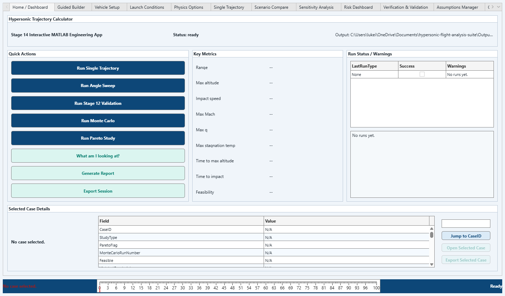
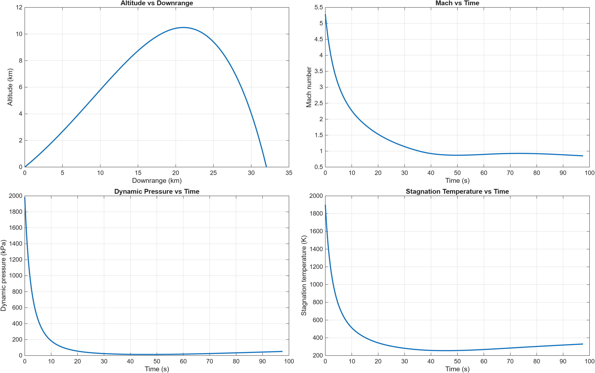
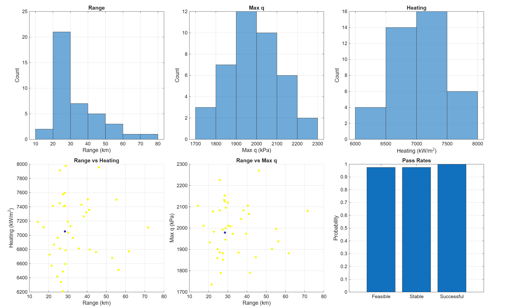

# Hypersonic Trajectory Calculator

A staged MATLAB engineering tool for conceptual hypersonic trajectory simulation, vehicle trade studies, environmental sensitivity, uncertainty analysis, and portfolio-ready visualization.

The project was built to show how trajectory performance changes as model fidelity increases from a simple 2D drag projectile to atmosphere-aware, geometry-aware, rotating-Earth, stability, 6-DOF, diagnostics, Monte Carlo, and app-based workflows. It is intended for educational and conceptual analysis only.

## Version 1.0 Highlights

- Clean `main.m` central entry point
- `stage = 0` Version 1.0 demo mode
- Editable top-level inputs for speed, launch angle, mass, length, diameter, body type, plotting, and exports
- Shared result standardization for trajectory summaries
- CSV export to `outputs/csv/`
- Plot export to `outputs/plots/`
- Summary text export to `outputs/`
- Archived pre-cleanup `main.m` in `archive/dev/`
- Documentation notes in `docs/model_assumptions.md` and `docs/validation_notes.md`

## Why This Project Exists

This project is a portfolio-style MATLAB simulation suite for learning and demonstrating aerospace engineering fundamentals. It emphasizes clear staged development, readable assumptions, reproducible demos, and comparative trends rather than high-fidelity prediction.

## Physics Included

- 2D projectile motion with drag
- Variable atmosphere and variable gravity
- Mach number, dynamic pressure, and stagnation temperature
- Vehicle reference area, fineness ratio, lift, drag, and angle of attack
- Spherical Earth and Earth rotation effects
- Launch angle sweeps
- Vehicle/body comparison and ballistic coefficient analysis
- Simplified thermal loading estimates
- Static margin, trim, and maneuverability estimates
- Environmental sensitivity cases
- Simplified 6-DOF baseline dynamics
- Diagnostics comparing simplified physics modes
- Monte Carlo, Pareto, and design-space studies
- MATLAB app interface

## Stage Descriptions

| Stage | Description |
| --- | --- |
| 0 | Version 1.0 polished demo |
| 1 | Baseline 2D projectile with drag |
| 2 | Atmosphere, Mach, dynamic pressure, stagnation temperature |
| 3 | Vehicle geometry, lift/drag, angle of attack |
| 4 | Spherical Earth and rotation effects |
| 5 | Launch angle sweep |
| 6 | Vehicle/body and ballistic coefficient comparison |
| 7 | Simplified thermal loading estimate |
| 8 | Stability, trim, and static margin |
| 9 | Environmental sensitivity |
| 10 | Simplified 6-DOF baseline |
| 11 | Integrated analysis suite backend |
| 12 | Diagnostics, validation, and portfolio outputs |
| 13 | Pareto, Monte Carlo, sensitivity, and optimization |
| 14 | MATLAB app / GUI |

## How To Run

1. Open MATLAB.
2. Set the current folder to this project directory.
3. Open `main.m`.
4. Edit the user settings near the top.
5. Run `main`.

For the polished demo:

```matlab
stage = 0;
main
```

For the MATLAB app:

```matlab
stage = 14;
main
```

For an individual stage:

```matlab
stage = 4;
main
```

## Example Demo Output

```text
===== HYPERSONIC TRAJECTORY CALCULATOR: VERSION 1.0 DEMO =====

Vehicle:
Mass: 5.000 kg
Length: 0.4500 m
Diameter: 0.0564 m
Reference area: 0.002499 m^2

Trajectory:
Initial speed: 1800.00 m/s
Initial launch angle: 25.00 deg
Range: ... km
Maximum altitude: ... km
Impact speed: ... m/s

Flight environment:
Maximum Mach: ...
Maximum dynamic pressure: ... kPa
Maximum stagnation temperature: ... K

Design comparison:
Best launch angle: ... deg
Best body type: ...
Static margin: ... % body length

Uncertainty:
Monte Carlo range mean: ... km
Monte Carlo range spread: ... km
```

## Outputs

Generated files are written under:

```text
outputs/
  csv/
  plots/
  screenshots/
  reports/
```

The `outputs/` folder is intentionally ignored by Git so generated files do not clutter the repository.

## Example Plots And Screenshots

The screenshots below are generated from the Version 1.0 demo and MATLAB app workflow.







## Project Structure

```text
hypersonic-flight-analysis-suite/
|-- main.m
|-- README.md
|-- docs/
|   |-- model_assumptions.md
|   |-- validation_notes.md
|-- Shared/
|-- Stage1/
|-- Stage2/
|-- Stage3/
|-- Stage4/
|-- Stage5/
|-- Stage6/
|-- Stage7/
|-- Stage8/
|-- Stage9/
|-- Stage10/
|-- Stage11/
|-- Stage12/
|-- Stage13/
|-- Stage14/
|-- archive/
|   |-- dev/
|-- outputs/        generated locally, ignored by Git
```

## Assumptions And Limitations

This model is intended for educational and conceptual trajectory analysis. It does not use classified aerodynamic data, flight-test data, real vehicle guidance logic, or validated high-fidelity CFD coefficients. Results should be interpreted as comparative trends rather than flight-certified predictions.

Important limitations:

- Aerodynamic coefficients are simplified lookup/trend models.
- Geometry effects are conceptual and based on reference area, fineness ratio, and body-type scaling.
- Heating, trim, and stability models are first-order estimates.
- The 6-DOF model is a baseline prototype, not a validated flight dynamics model.
- Monte Carlo outputs reflect assumed uncertainty ranges, not measured manufacturing or atmospheric statistics.
- No targeting, guidance, interception, or real weapon-system logic is included.

## Future Work

- Add a lightweight automated smoke-test script for all noninteractive stages.
- Improve app export workflows and summary tables.
- Add optional validation against open textbook examples.
- Expand unit-consistency checks for all stage result structs.
